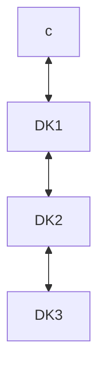

# MaDChaSE
This repository contain software for perfoming channel estimation using three nRF52833 Development kits (DK) and a PC. The firmware for the DKs are in `iq_samples\`and the software performing and analysing the measurements are in `runner\`. 

## Runner
Python script that starts the measurement procedure and stores the result in timestamped folders. Each measurement are processed the same way.


| Measurement/Roles | DK1       | DK2       | DK3       |
|-------------------|-----------|-----------|-----------|
| Channel 1         | reflector | initiator | none      |
| Channel 2         | none      | reflector | initiator |
| Channel 3         | initiator | none      | reflector |




### Setting up the environment
Make virtual environment for python in the folder runner/ and install necessary packages.
```shell
python3 -m venv env
```

```shell
source env/bin/activate
```

```shell
pip install -r requirements.txt
```

Run `main.py`, this sends a message to the initiator over uart which tells it to start a measurement. The results are then sent with uart to the laptop. The script then saves the data to json, and plots. Each measurement with its files are saved into separate folders by timestamp. Both reflector and initiator must be connected to the laptop with USB.

<!---
### Create `requirements.txt`
```shell
pip install pipreqs
```

```shell
pipreqs .
```
This command must be run in the `runner\` directory.
-->


## IQ Sampler
Firmware for the DKs. Reads UART for roles, then performs the measurements.